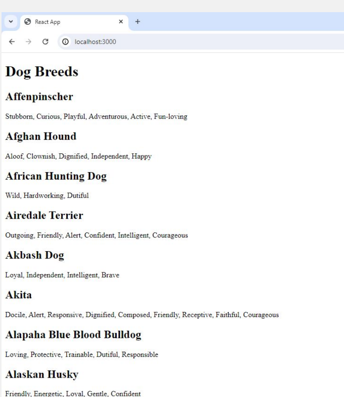
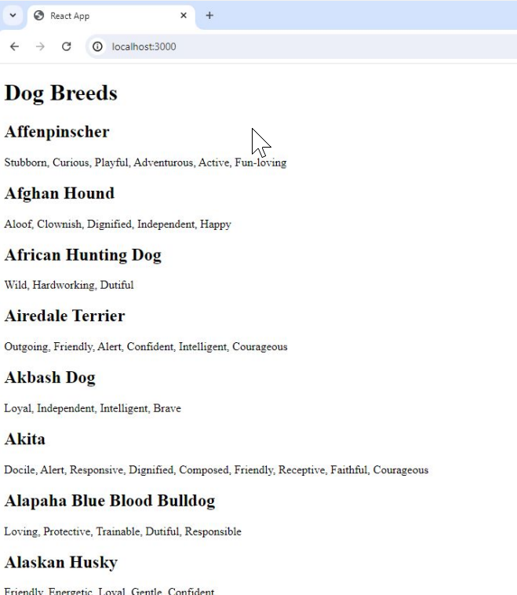

# Practic_REACT_gitHub
Задание 1
Создание приложения с использованием Redux, extraReducers и createAsyncThunk.
1. Установка необходимых библиотек.
● Создайте новый проект React.
● Перейдите в директорию вашего проекта.
● Установите библиотеки Redux Toolkit, React-Redux, Redux и Axios с помощью команды: `npm install
@reduxjs/toolkit react-redux redux axios`.
2. Создание асинхронного действия.
● Внутри директории `src` создайте новый файл с именем `thunks.js`.
● В этом файле импортируйте функции из библиотеки `@reduxjs/toolkit` и `axios`.
● Создайте асинхронное действие с использованием `createAsyncThunk`, которое будет отправлять GETзапрос на URL `https://api.thedogapi.com/v1/breeds`.
● Убедитесь, что действие возвращает данные, полученные с сервера.
Задание 1
3. Создание slice с extraReducers.
● В директории `src` создайте новый файл с именем `dogsSlice.js`.
● В этом файле импортируйте функцию `createSlice` из библиотеки `@reduxjs/toolkit` и асинхронное
действие из `thunks.js`.
● Создайте slice с именем `dogs`, который будет содержать начальное состояние, включающее массив для
хранения данных, строку для хранения статуса (`idle`, `loading`, `succeeded`, `failed`) и поле для
хранения ошибок.
● В `extraReducers` используйте `builder` для обработки трех состояний асинхронного действия:
○ `pending`: установите статус в `loading` и очистите поле ошибок.
○ `fulfilled`: установите статус в `succeeded`, сохраните полученные данные в состояние и выведите их
в консоль.
○ `rejected`: установите статус в `failed`, сохраните сообщение об ошибке в состояние и выведите
ошибку в консоль.
Задание 1
4. Настройка Redux store.
● В директории `src` создайте новый файл с именем `store.js`.
● В этом файле импортируйте функцию `configureStore` из библиотеки `@reduxjs/toolkit` и редуктор из
`dogsSlice.js`.
● Настройте store, добавив созданный редуктор в объект `reducer`.
5. Создание компонента для отображения данных.
● В директории `src` создайте новый файл с именем `DogsComponent.js`.
● В этом файле импортируйте необходимые хуки из библиотеки `react-redux` и асинхронное действие из
`thunks.js`.
● Создайте React-компонент, который будет использовать хук `useEffect` для отправки асинхронного
запроса при монтировании компонента.
● Используйте хук `useSelector`, чтобы получить данные, статус и ошибку из состояния Redux
Задание 1
● Реализуйте условный рендеринг в компоненте:
○ Если статус равен `loading`, отображайте сообщение "Loading...".
○ Если статус равен `failed`, отображайте сообщение об ошибке.
○ Если статус равен `succeeded`, отображайте список данных, полученных с сервера.
6. Интеграция компонента в приложение.
● В файле `App` импортируйте компонент `Provider` из библиотеки `react-redux` и store из `store.js`.
● Импортируйте созданный компонент для отображения данных.
● Создайте главный компонент приложения, который будет оборачивать компонент для отображения
данных в `Provider`, передавая ему store.
7. Запуск приложения.
● Запустите приложение с помощью команды: `npm start`.
● В браузере должен отобразиться список пород собак, загруженный из The Dog API. В случае ошибки, вы
должны увидеть сообщение об ошибке в консоли и на экране.

<!--  -->
